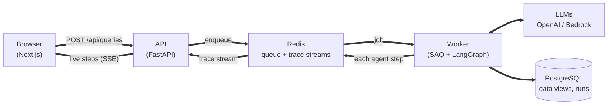
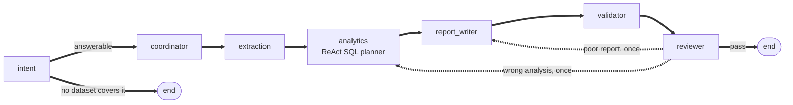

# Architecture -- Agentic Policy Data Analytics Platform

## 1. Overview

A full-stack agentic system: a policy researcher asks a question in plain English; a multi-agent pipeline picks the relevant government datasets, computes the statistics, writes a cited report and checks every number in it; the agents' reasoning steps are shown in the UI.

**Request flow.** The API only accepts questions and relays progress; a separate worker does the slow work.

Where it would go next, for secure government use: [INNOVATION.md](INNOVATION.md).

## 2. Agent design

### 2.1 Current pipeline (built)

**Agent pipeline**, run by the worker for each question:

| Node | LLM? | What it does |
|---|---|---|
| **intent** | Yes (quality tier) | Restates the question as one precise reading (a share names its denominator; relative time becomes concrete years), declines what no dataset covers, and returns `time_range` ({start, end}) when the question spans periods, read from its meaning, not keywords (`app/agents/nodes/intent.py`) |
| **coordinator** | Yes (fast tier) | Reads the dataset catalog (`manifest.yaml`) and picks the datasets relevant to the question (structured output) |
| **extraction** | No | Checks each chosen dataset is stored, maps it to its typed view, and traces the data-quality facts inferred at ingest (totals/overlaps excluded, unverified periods, summable measures) |
| **analytics** | Yes (quality tier; fast-tier plans ran out of steps on multi-step questions) | ReAct planner (`app/agents/planner.py`): tools `describe_view`, `sample_rows`, `run_sql`, then `submit_answer(sql, interpretation, chart)` or `cannot_answer`. Max 8 tool calls. Every query goes through the SQL gate and read-only runner; a rejection is an observation the planner fixes. For a question over a time range, a final query without the time column is sent back once. The submitted query's result becomes `Finding`s |
| **report_writer** | Yes (quality tier) | Writes the report from the query result and findings only, stating how the question was interpreted and citing sources |
| **validator** | No | Every number in the report must match a finding (1% tolerance); numbers from the question or result labels (cells or column names) count as context. Appends a warning otherwise |
| **reviewer** | Yes (quality tier) | LLM judge of meaning, not arithmetic: sees the question, what each queried column means, the SQL, result and report. `pass`, `wrong_analysis` (back to analytics) or `poor_report` (back to report_writer), with the reason as feedback. Max 1 re-route; after that the answer keeps a visible caveat |

**Safety of LLM-written SQL** (`app/data/sql_gate.py`, `sql_runner.py`): sqlglot allows one `SELECT` over `data` views only, known columns (with "did you mean" hints), no `SUM` over non-additive measures, no side-effect functions, and runs the SQL regenerated from the checked tree. Postgres then runs it in a `READ ONLY` transaction as the `NOLOGIN` role `data_reader` (SELECT on the views only), with a 5 s timeout and a 500-row cap. Each layer alone stops a write.

**Why the reviewer:** the validator proves the report matches the result, not that the result answers the question. Example caught live: "Which gender works longer?" was answered by averaging (then summing) a head-count column; the reviewer sent it back and the re-plan compared each sex across hours bands.

### 2.2 Principles

- LLMs interpret the question, choose what to compute and judge the result; **the database computes every number**. No LLM ever re-types data.
- **Data rules live in the views, not the prompt:** views expose only rows that are safe to add up. A spike showed prompt instructions alone did not stop double-counting; view shape did. The rules are inferred from the data (section 4.5), not written per dataset.
- Column knowledge comes from the profile made at ingest, so the query path has no hardcoded column names or operation lists.

### 2.3 Shared state

One `AgentState` (`backend/app/agents/state.py`), shared by all nodes and kept JSON-serialisable: the question (`query`, the intent's `intent_query` and `time_range`), `run_id`, `provider`, `plan`, `raw_extracts`, `analysis` (the SQL, its result and chart spec), `findings`, `report_markdown`, `grounded`, `trace_events`, `llm_calls` (token usage), `fallbacks`, `errors`, and the review loop's `review_feedback` / `review_next` / `review_rounds`. No data rows live in the state beyond the final query result.

### 2.4 Agent trace (ReAct visibility)

Every node calls `emit_trace(state, node, step_type, content)` with `step_type` in `reasoning | action | observation`.

- Trace events are persisted to `agent_traces` at the end of the run, numbered in emission order (`seq`). During the run, the worker installs a trace sink (a context var read by `emit_trace`), so each event -- including every planner tool call -- is appended to the Redis Stream `agent-trace:{run_id}` as it happens, not once per node.
- `GET /api/agent-trace/{run_id}` (SSE): `trace` events, then `done` with the run status. Reads the stream from the start, so a late subscriber misses nothing; the stream expires 1 h after the run, after which the route replays from `agent_traces`. Gives up after 10 min if a crashed worker never writes `done`.
- **Why a Stream, not pub/sub:** pub/sub keeps nothing, and the first events fire before the browser can subscribe, so they'd be lost.
- The frontend follows the stream (`lib/runs.ts`): steps appear live; if the stream errors or is silent for 45 s it polls `GET /api/queries/{run_id}`; after 5 minutes it gives up. Following can be cancelled (New Chat, leaving the page); the run itself still finishes on the server.

### 2.5 Failure handling

- Each graph step has an error boundary (`guarded`, `app/agents/graph.py`): a failure is logged, recorded and traced, and the run continues with what's done (e.g. a reviewer failure keeps the finished report; the run ends `partial`). A missing dataset is reported without stopping the others; no matching dataset gives `partial` with an honest explanation.
- Every run ends. The worker saves in a fresh session; if saving fails the run is marked `failed`; the trace stream always gets `done`; a job timeout saves the run as `failed`. If the queue is unreachable, `POST /api/queries` marks the run `failed` and returns 503.
- Gate-rejected or failing SQL is returned to the planner as an observation; the planner can decline (`cannot_answer`) and the run ends `partial` with the reason.
- Automatic LLM provider fallback, per call (3.2).
- An LLM call limit per question (8.3): when reached, the remaining LLM steps are skipped, the run ends `partial` and the report says it stopped early.
- Quality review sends a wrong analysis or a poor report back to the step that caused it, once; a second failure keeps the answer with a caveat.

## 3. LLM providers

### 3.1 Provider factory

Two independent choices:

- **Provider:** `openai` and `bedrock` (`langchain_aws.ChatBedrockConverse`) built; `azure_openai` / `vertex_ai` stubs.
- **Tier:** fixed per node, mapped to model ids in `.env`: `fast` for the coordinator (picking datasets); `quality` for intent, analytics (the SQL planner), report writer and reviewer. Nothing switches tier during a run.

### 3.2 Switching and fallback

- **per-request choice:** `POST /api/queries` takes an optional `provider`; otherwise `LLM_DEFAULT_PROVIDER`. Nodes get their model via `node_model(state, node, tier)` (`app/agents/llm.py`).
- **automatic fallback:** `get_chat_model()` returns a `FallbackChatModel` holding the chosen provider, then `LLM_FALLBACK_PROVIDER`. Any error on a call retries that call on the next provider. The switch is a trace event ("LLM provider openai failed (AuthenticationError); retried on bedrock") and is stored in `analysis_runs.provider_used` (e.g. `openai->bedrock`). A provider that isn't configured is skipped, so either one alone still works.
- **Why not LangChain `.with_fallbacks()`:** it doesn't report which provider answered, so the switch couldn't be traced. The wrapper mirrors `bind_tools` / `with_structured_output` / `ainvoke`, so node code is unchanged.
- **Setup note:** each Anthropic model needs a one-time AWS Marketplace subscription per account (done from the Bedrock Playground by an admin); the app's IAM user only needs `bedrock:InvokeModel`.

## 4. Data layer

### 4.1 Datasets

| Dataset | Source | Format | Coverage |
|---|---|---|---|
| `retrenchment_by_residential_status` | data.gov.sg | CSV | 2007-2025 |
| `mrt_to_junior_college_travel` | data.gov.sg | CSV | no time dimension (189 stations x 18 colleges) |
| `graduate_employment_survey` | data.gov.sg | CSV | 2013-2024 |
| `mom_usual_hours_by_occupation_{2023,2024,2025}` | MOM | Excel (sheet F2) | one file per year, one combined view |

The files are curated mock data derived from public downloads. Details and known data issues: `DATA_SOURCES.md`.

### 4.2 Manifest

The application relies on `manifest.yaml` as the single source of truth to check data files. It catalogs every dataset with **metadata only**: `id`, `source`, `title`, `topic`, `mode` (`file` | `api`), `file_path`, `format`, `sheet_name`, `resource_id`, `api_fallback`, `group` (files that form one view), `year` (for files with no year column). The coordinator reads it to choose datasets.

`column_meta` is optional and holds only units and descriptions; there are no per-dataset data rules.

**Source mode is a property of the dataset, not a per-query switch.** `api` mode is only for pre-vetted data.gov.sg `resource_id`s.

### 4.3 Loading and cleaning

- **Parsers:** `csv_parser.py` (pandas; digit strings with a leading zero stay text, e.g. postal codes); `excel_parser.py` (openpyxl, built for the MOM F2 layout); `api_client.py` (data.gov.sg Datastore Search, pagination, 2 attempts with timeout; built, but no current dataset uses `mode: api`).
- **Missing values:** `-`, `na`, `N.A.` and similar become missing, never 0.
- **Cleaning at ingest** (`app/data/cleaning.py`): adds `year` from the manifest where a file has none.

### 4.4 Seeding and typed views

On startup the backend runs Alembic migrations, then `scripts/seed_datasets.py`:

1. **Prune:** datasets no longer in the manifest lose their stored rows; their catalog row is deleted unless a past analysis cites it.
2. **Seed:** each file is parsed, profiled and written to `dataset_records` (one JSONB document per row), with a `datasets` catalog row. Skipped when the file hash and `PROFILER_VERSION` are unchanged.
3. **Views:** the `data` schema is dropped and rebuilt: one typed view per dataset (real `integer` / `double precision` / `text` columns), files sharing a `group` combined with `UNION ALL`, plus a `<view>_totals` view (additive measures summed per period) where there is something to sum.

Views are derived, so rebuilding them loses nothing. One generic table avoids a table per CSV. Reading through a JSON view is 2-7x slower than a typed table (about 1 ms at current sizes); materialized views close the gap past ~100k rows.

### 4.5 Data quality and structure inference

The profiler records per column: role (time / dimension / measure), range, nulls, distinct values. `app/data/structure.py` then infers, **from the numbers only**:

- **Hierarchy:** a value equal to the sum of other values in every cell (within 3 rounding units, at least 5 cells) is their parent. Views keep the lowest level and add `<column>_level_N` parent columns, so any level is a `GROUP BY`.
- **Grand totals and overlaps:** a parent that is at least every other value everywhere is a grand total and is excluded; values outside its breakdown overlap it (MOM `More Than 48 Hours`).
- **Parallel classification schemes:** two separate groups of values with equal sums; the one covering fewer cells is dropped.
- **Classification eras:** a new era starts when a column's values change; an era whose relations don't form a clean tree (a value with two parents, cycles) is marked unverified and left out of the views.
- **Additivity:** a measure is additive only if some column proves it; rates, means and medians default to non-additive, the safe side for `SUM`.

## 5. Database

PostgreSQL only, SQLAlchemy async ORM, Alembic migrations. All primary keys are Postgres `UUID`.

| Table | Purpose | In use? |
|---|---|---|
| `datasets` | Catalog row per dataset: source, mode, file path, content hash, `quality_report` (incl. profiler version) and `schema_profile` (JSON, incl. inferred structure) | Yes |
| `dataset_records` | Every cleaned source row as a JSONB document; read through the generated views in the `data` schema | Written by seeding; read by the SQL planner through the views |
| `analysis_runs` | One per query: text, status, provider, report, the analysis (SQL, result, chart spec; column `chart_specs`), `token_usage` (per-model totals) | Yes; `session_id`, `query_hash`, `estimated_cost_usd` reserved (dollar costs deliberately not computed, section 8.3) |
| `analysis_run_datasets` | Which datasets a run used | Yes |
| `agent_traces` | Persisted trace events, in order (`seq`) | Yes |
| `llm_calls` | One row per LLM attempt: node, tier, provider, model, input / output / cached input tokens, latency, outcome | Yes |
| `findings` | Computed values with dataset and field reference | Yes |
| `sessions` | Chat sessions | Reserved (planned chat UI) |

## 6. Backend API

| Endpoint | Purpose |
|---|---|
| `POST /api/queries` | Submit a question: `202` + `run_id`, run on the worker. Rate-limited per client IP (429); question 1-2,000 characters and provider `openai` / `bedrock` only (422); 503 if the queue is down |
| `GET /api/health`, `GET /api/health/providers` | Liveness (the API process only); which providers are configured |
| `GET /api/health/ready` | Readiness: Postgres, Redis and a live worker, 2 s timeout each, run together; 200 or 503 naming what's down |
| `GET /api/queries/{run_id}` | Poll result (fallback if the stream drops); includes `token_usage` (per-model totals + each call) once the run finishes |
| `GET /api/agent-trace/{run_id}` | Live trace via SSE |
| `GET /api/analyses` | History list (query, status, provider, timestamps); detail reuses `GET /api/queries/{run_id}` |

**Async processing:** SAQ worker (`backend/app/worker.py`), same Docker image as the API with a different command (`worker` service in `infra/docker-compose.yml`); `scripts/queue_status.py` inspects the queue.

## 7. Frontend

- A typical GenAI chat application layout, optimized for concise question and displaying data result.
- **State:** plain `fetch` in effects, each cancelled on cleanup (`AbortController`); a small context for the shell (History refresh). No data-fetching or global state library: not needed at this size.
- **Tests:** Vitest + Testing Library (chart data rules, tabs, token usage, run following, New Chat, shell).

## 8. Non-functional requirements

### 8.1 Performance

**Targets:** first trace event on screen within 2 s of submitting; a simple single-dataset query completes within 60 s.

**Still open:**

- Seeding (pandas, openpyxl, structure inference) runs on the API's event loop at startup; move it to a thread or a one-off job.
- Views are rebuilt (`DROP SCHEMA data`) on every backend start, which can break planner queries in flight.
- **Measured** (Locust, mocked LLM, TESTING.md): the stack adds under 0.5 s per run; the limit is worker capacity (one worker runs 4 jobs at once, ~0.7 runs/s at ~5 s of LLM time per run), and throughput scales almost linearly with `--scale worker=N` (3 workers: 2.9x). With real LLMs, provider rate limits come first.

### 8.2 Observability

- Structured logs as the integration point. `LOG_FORMAT=json` makes every line (API, worker, Uvicorn) one JSON object; lines logged during a run carry its `run_id` (a context variable bound by the worker). Events with fields: `http request` (middleware, `app/api/middleware.py`), `llm call` (tokens, model, latency, outcome), `agent step`, `run finished` (status, duration, calls, fallbacks). Per-run detail also lives in `agent_traces` and `llm_calls`.
- Readiness check `GET /api/health/ready` (Postgres, Redis, a live SAQ worker from its registry); the one thing logs can't show is a component that isn't there.

### 8.3 Cost

- Model tiering (fast / quality); prompts contain findings, never raw data.
- Token usage tracking: `FallbackChatModel` attaches a LangChain callback to every attempt and records the token counts the provider reports (`usage_metadata`: input, output, cached input), the model that answered, latency and outcome (`app/llm/usage.py`). `node_model()` tags each call with its node and tier; rows go to `llm_calls`, per-model totals to `analysis_runs.token_usage`. Counts are the provider's own, not estimated. Totals are per model only: models tokenize differently, so a fallback run has one entry per model and no grand total. A failed attempt that got no answer has zero tokens; one that answered but failed parsing keeps its billed tokens.
- **Why tokens, not dollars:** a dollar figure needs a hand-maintained price table and would still be an estimate; tokens are exact.
- **LLM call limit per question:** `MAX_LLM_CALLS_PER_RUN` (default 20; 0 = off) caps the calls one run may make, counting every node, the reviewer's re-route and fallback retries. `node_model()` checks the run's `llm_calls` before each attempt; a refused call raises `LlmCallLimitReached`, which the step's error boundary records without a stack trace. The run keeps what it has, ends `partial`, and the report gets a note that it stopped early (important when a re-route is cut short: the kept answer is one the reviewer rejected).

### 8.4 Security and privacy

- Request validation (Pydantic: question 1-2,000 characters; only `openai` / `bedrock` can be chosen, never `mock` or unbuilt stubs); **rate limiting** on `POST /api/queries` (`RATE_LIMIT_QUERIES_PER_MINUTE` per client IP, default 10, Redis fixed window, 429 with `Retry-After`; fails open if Redis is down; `app/api/rate_limit.py`); CORS restricted to the frontend origin; secrets only in per-service `.env` files (never committed); `pydantic-settings` validates config at startup.
- **Privacy:** all datasets are public, aggregate statistics; no personal data flows through the system.

## 9. Deployment

- `infra/docker-compose.yml` runs `db` (postgres:16), `redis` (redis:7), `backend`, `worker` (same image, SAQ command; scale with `--scale worker=N`) and `frontend`; startup migrates and seeds automatically. Opt-in overlays: `docker-compose.dev.yml` (frontend hot reload) and `docker-compose.loadtest.yml` (mock LLM, separate database). Each service has its own `.env` (copy from `.env.example`); there is no root `.env`.

## 10. Key decisions

| Decision | Choice | Why |
|---|---|---|
| Agent framework | LangGraph | The planned retry and review loops need conditional edges; state is inspectable at every step |
| Agent count | 7 nodes: 5 use an LLM (intent, coordinator, analytics, report writer, reviewer), 2 are code (extraction, validator) | Each failure mode gets its own step: reading the question, choosing data, computing, explaining, checking numbers (code), checking meaning (LLM) |
| Who computes numbers | The database (LLM-written SQL, checked before running), never an LLM | Every number stays verifiable |
| Query language | Checked SQL over generated views, not a custom plan vocabulary | A custom vocabulary is our own capability list to maintain; SQL is standard and LLMs are fluent in it. Checks + view shape keep it safe (spike: valid SQL 12-14/14 first try) |
| Task queue | SAQ (Redis) | Async-native; Celery is too heavy; arq is in maintenance mode |
| Real-time transport | SSE | The trace only flows server -> client; plain HTTP with built-in browser reconnect. The brief mentions WebSocket; SSE serves the same purpose |
| Database | PostgreSQL only | Unit tests mock the database; integration tests use real Postgres, so a second engine adds nothing |
| Dataset rows | One generic JSONB table + typed views generated per dataset | SQL generation needs real columns; one fixed table avoids per-CSV table maintenance; views are rebuildable |
| Data rules (totals, hierarchies, additivity) | Inferred from the numbers at ingest, not declared per dataset | New files work without code or manifest rules; inference needs a tolerance, minimum evidence and a clean tree, and uncertain eras are excluded rather than guessed |
| Source mode | Per dataset, in the manifest | Reliability differs by dataset, not by question; live API only for pre-vetted tables, with file fallback |
| LLM providers | OpenAI + AWS Bedrock | Bedrock is a real cloud platform, a literal answer to "multi-cloud" |
| Provider switching vs. fallback | Both, separately | The brief asks for both |
| Frontend state | Plain fetches (cancelled on cleanup) and a small shell context; no data or state library | Nothing needs one at this size |
| Hosting | Local Docker Compose | Bare minimum Docker, a thin layer of cloud configuration (such as AWS Cloudformation or Terraform) will be needed to deploy to any of the popular cloud infrastructure |

## 11. Future work

- SingStat live integration; any free-text dataset discovery.
- Provider-native prompt caching; semantic (embedding-based) matching of repeat questions.
- Vector database / RAG over past analyses.
- Streaming the report text token by token.
- Production concerns (for the Innovation Assessment): SSO/RBAC, audit logging, network isolation, data classification.
